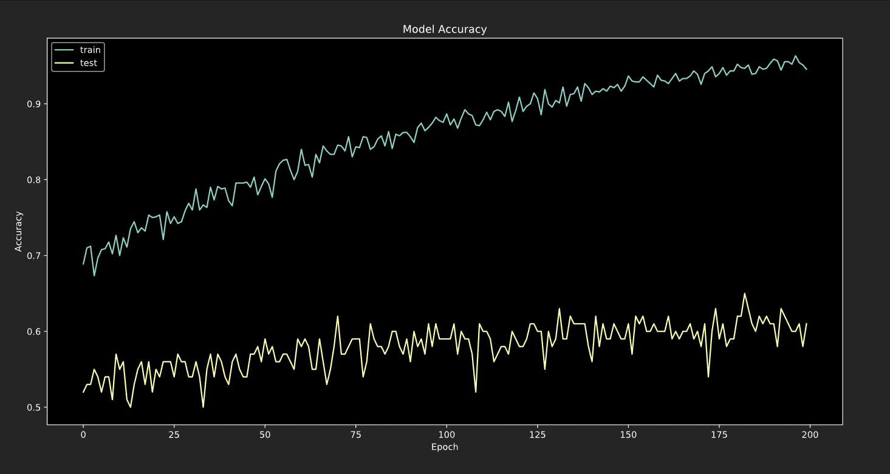
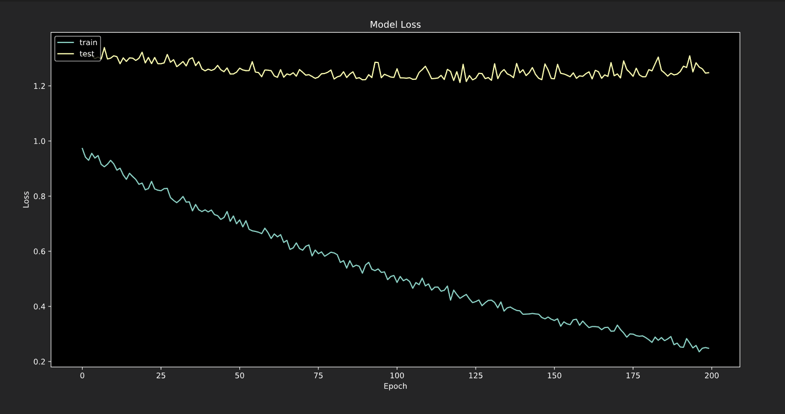

# Sound Processing project

This is a written project with regard to processing sound using keras deep learning library. These are the planned application:
- [x] [Genres classification](https://github.com/dewanderelex/SoundProcessing)
- [ ] Music auto-tagging
- [ ] Instrumental classification
- [ ] Tempo classification
- [x] [Deep Learning Jazz generator](https://github.com/dewanderelex/MusicGenerator)
- [ ] Sort music by genres, artist, tempo, tags
- [ ] Piano analysis
-------------
## Music Genres Classification using deep learning neural network

In this small project, I try to make a classifier with two dimensional neural network to distinguish among 11 genres of music. The data I use contains 1000 pieces of 30 seconds music that are separated into different classes from GTZAN, and it can be downloaded [here](http://opihi.cs.uvic.ca/sound/genres.tar.gz) or on the [GTZAN website](http://marsyas.info/downloads/datasets.html).

-------------
## Comission Note:

#### Sep 9, 2019:
- model.h5 file is a weight of 1D Convolutional network with shape (max_feature, max_channels). Feature train: stft.
- model2D.h5 file is a weight of 2D Convolutional network with shape (max_feature, time_length, max_channels). Did not uploaded due to large file.
- model2D_2.h5 file is also a weight of 2D Convolution network, with the same shape but the channel is set in last instead of front.
- Conclusion: Feature engineering is not good due to low accuracy, more have to be done with extracting feature from data!

#### Sep 15, 2019:
- After extracting the data as spectrogram and create model based on 128x1308 pixel, I successfully train the model with an accuracy of 99.90 % and loss of 1.61%. I realize that reducing the learning rate to the factor of 1e(+n) may improve the chance of weights being rounded errorly.
- Plan for the next part: write a clear data generator for the network, write cleaner code, write documentation, seperate files by utilities, write test.

#### Oct 14, 2019:
- Update Training Analysis

-------------

## Author: Alex Nguyen
#### Gettysburg College Class of 2022
